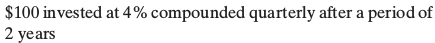
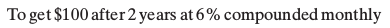
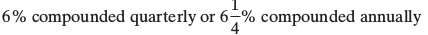
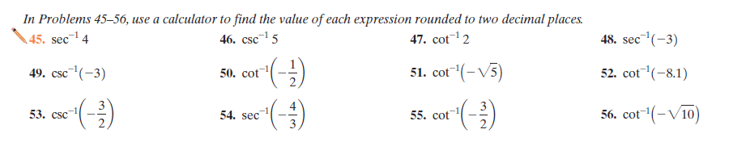

# Math problems queue

Trying an alternative approach.

I'll list the source of problems instead of their "type." I'll also try to organize them this way in the source.

## Sullivan Algebra

### 6.7: Financial models

Compound interest formula

$$
A = P(1+\frac{r} n)^{nt}
$$

Continuous compound interest formula

$$
A = Pe^{rt}
$$

#### x compound_interest_discrete_find_a

Find the amount $A$ that results from each investment

#### x compound_interest_discrete_find_p

Find the present value of the investment

#### x compound_interest_continuous_find_p

#### x compound_interest_discrete_find_effective_roi

Find the effective ROI over a year for the following investment

#### x compound_interest_continuous_find_effective_roi

#### x compound_interest_compare_discrete_vs_discrete

Find the better deal.

### 7.2

## Sullivan Trigonometry

### 3.2

#### find_trig_func_arc_inverse_with_calculator

Generate something in the domain of one of these functions:

- arccsc: (-inf, -1) U (1 ,inf)
- arcsec: (-inf, -1) U (1 ,inf)
- arccot: -inf, inf

##### steps

- choose one of the following functions:
  - arccsc
  - arcsec
  - arccot
- choose number between -10, 10, and outside of the gap of the domain of the specific function that is one of the following
  - fraction
  - sqrt of a number
  - whole number
- put the number in the inverse function in latex
- round the result to two decimal places and send it baby

###

## My ideas